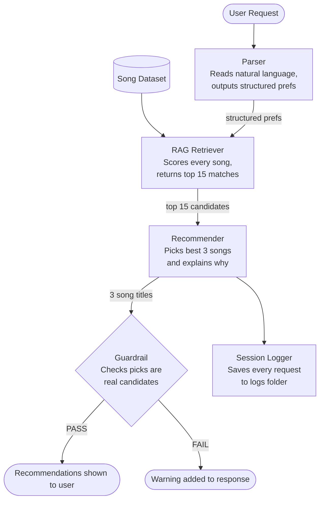
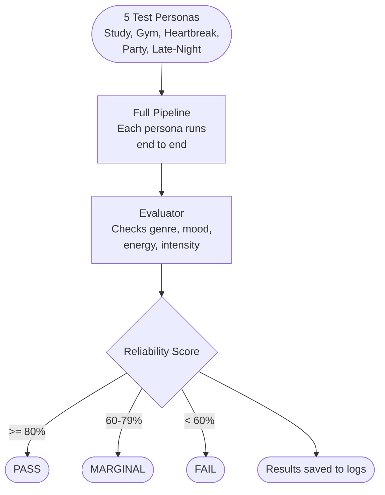

# TuneMatcher 2.0 — System Diagram

## Main Pipeline

```mermaid
flowchart TD
    A([User Request]) --> B

    B["Parser
    Reads natural language,
    outputs structured prefs"]

    D[(Song Dataset)] --> C

    B -->|structured prefs| C["RAG Retriever
    Scores every song,
    returns top 15 matches"]

    C -->|top 15 candidates| E["Recommender
    Picks best 3 songs
    and explains why"]

    E -->|3 song titles| F{"Guardrail
    Checks picks are
    real candidates"}

    F -->|PASS| G([Recommendations shown to user])
    F -->|FAIL| H([Warning added to response])

    E --> I["Session Logger
    Saves every request
    to logs folder"]
```

## Testing Path

```mermaid
flowchart TD
    A(["5 Test Personas
    Study, Gym, Heartbreak,
    Party, Late-Night"]) --> B

    B["Full Pipeline
    Each persona runs
    end to end"] --> C

    C["Evaluator
    Checks genre, mood,
    energy, intensity"] --> D

    D{"Reliability Score"} -->|>= 80%| E([PASS])
    D -->|60-79%| F([MARGINAL])
    D -->|< 60%| G([FAIL])

    D --> H([Results saved to logs])
```
